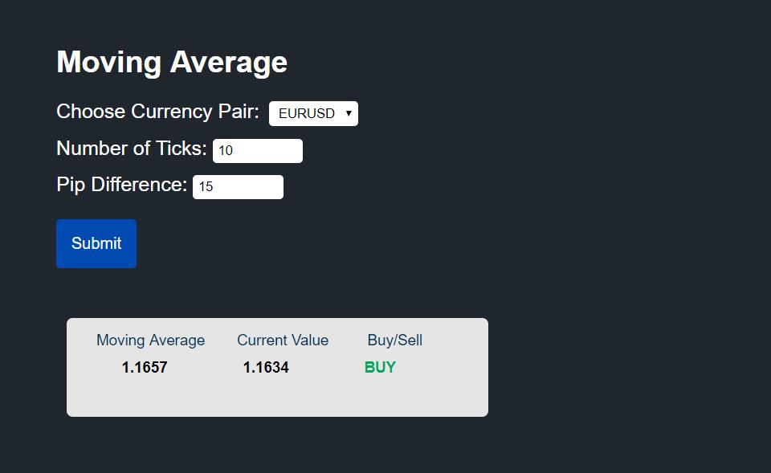
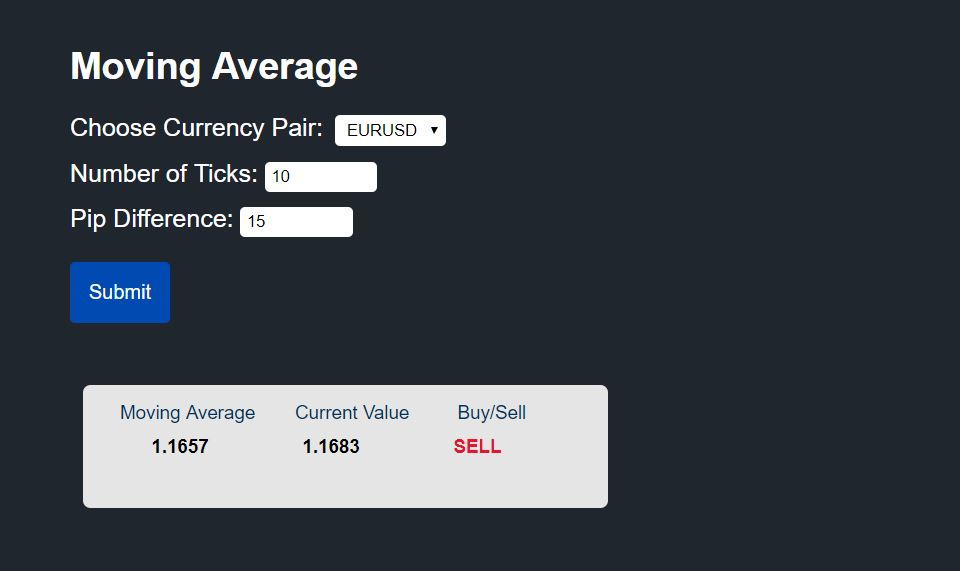
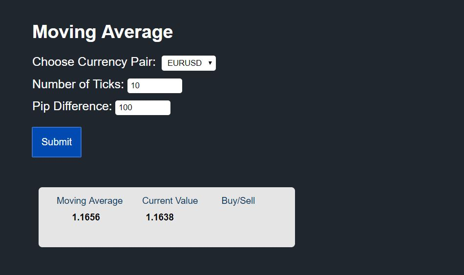

# React Moving Average

A moving average (MA) is a widely used indicator in technical analysis that helps smooth out price action by filtering out the noise from random price fluctuations. 

It is a trend-following, or lagging, indicator because it is based on past prices.

The moving average is calculated over a period of time or certain number of past ticks/prices and is compared with the current tick/price. If the moving average is less than the current price, we want to buy and if it is greater than the current price, we want to sell.

## Problem Statement

You are given:

1. a REST API which has the list of currency pairs : `https://restsimulator.intuhire.com/currency_pairs`
2. a Websocket : `wss://stocksimulator.intuhire.com`

Your task is to: 

1. Create a dropdown menu with all the currency pairs fetched from the REST API.

2. Add two input fields for:
    * Number of ticks - get the number of ticks over which the moving average will be calculated. For example, if this is set to 10, the initial moving average would be the average of the first 10 ticks. When the 11th tick arrives, the new moving average would be the average of 2nd to 11th tick (10 latest ticks) and so on.
    * Pip Difference - A pip of movement occurs each time the fourth decimal place of the price moves by one. For example, if the EUR/USD currency pair moves from 1.1608 to 1.1609, that is one pip of movement. If it moves from 1.1620 to 1.1608, that is 12 pips. Pip difference is always positive. This value is the minimum pip difference needed to specify Buy/Sell.

3. Add a submit button. On clicking it, 
    * establish the connection to the Websocket by sending a json message of the form `{"currencyPair":"EURUSD"}` if EURUSD was selected in the dropdown.
    * once you start recieving the prices from the Websocket one by one, calculate the moving average over the number of ticks given in the input. In the mean time, display a message "Please Wait...".
    * display the moving average, current price for every consecutive tick.
    * display BUY/SELL depending on the minimum pip difference given in the input:
        * If the current price is less than the moving average and this difference is greater than or equal to the pip difference, display BUY.  
        * If the current price is greater than the moving average and this difference is greater than or equal to the pip difference, display SELL.  
        * If the pip difference between the current price and the moving average is less than the pip difference specified in the input, display nothing.

## Difficulty

Intermediate

## Framework

React

## Run

`cd react-project`

`yarn start` 

Navigate to port 3000. 

## Screenshots

